# Nivel 1:

Prueba de errores:

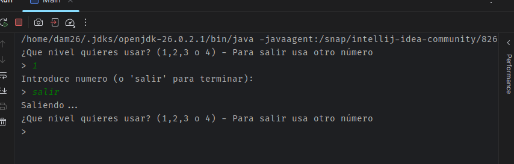
"Salir" --> Funciona  

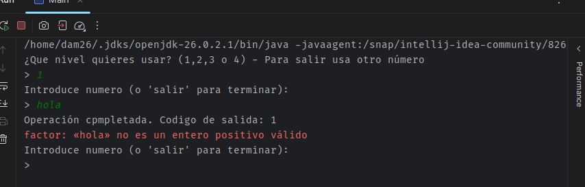
Texto --> Funciona

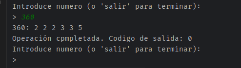
Numero --> Funciona

## Tabla
 
### 360: (2 2 2 3 3 5 - Codigo salida: 0)
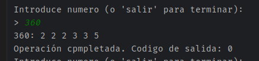

### 1: ( - Codigo de salida: 0)
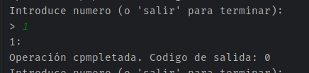

### 17: (17 - Codigo de salida: 0)
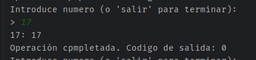

### hola: ( - Codigo de salida: -1)
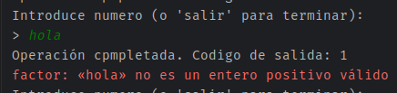

### -5: ( - Codigo de salida: -1)
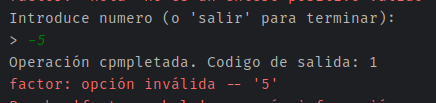

## Eror:
Basicamente no me dejaba volver hacia atras, es decir al seleccionar la opción 1 no me dejaba volver a elejir entre las opciones, hasta que hice el bucle while(true) con los breaks para que rompiese el case y no finalizase el bucle. Basicamente se soluciono añadiendo el bucle.

#Nivel 3

Prueba de errores:
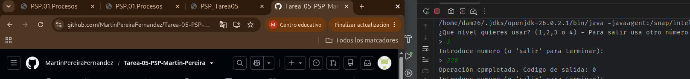
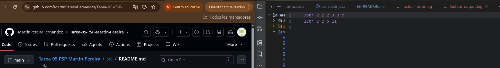

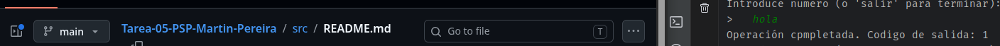
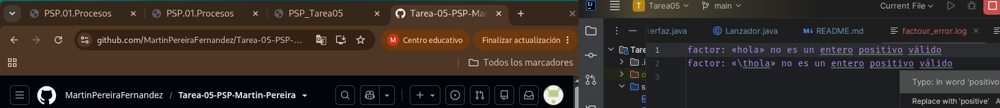